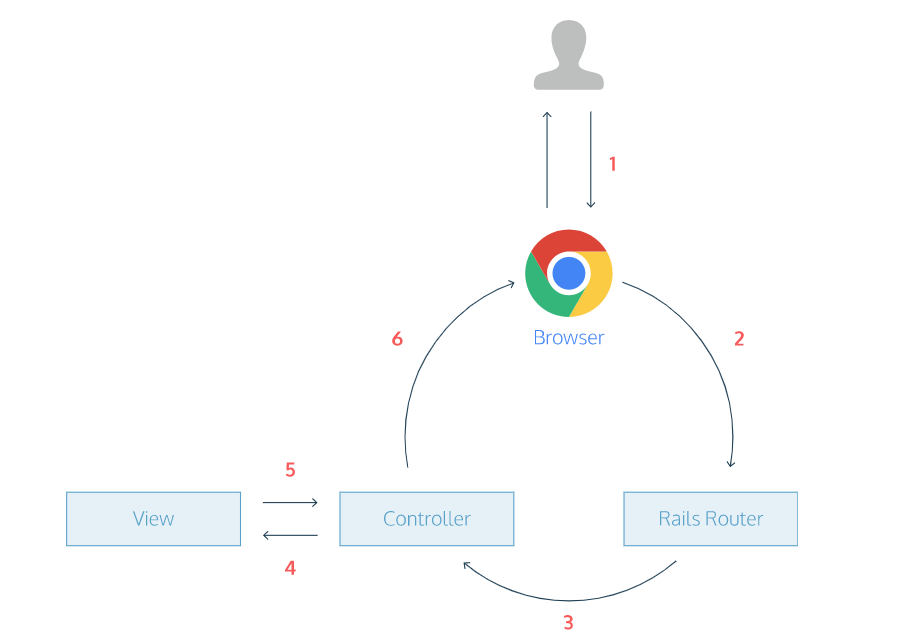

## Describe the Web-Request-Response-Cycle?
[ref](https://www.codecademy.com/articles/request-response-cycle-static)
 is a useful guide to see how all the app’s files and folders fit together. The request/response cycle traces how a user’s request flows through the app.
 - user typ URL in his browser then presses Enter
 - the browser makes a request for that URL
 - The router maps the URL to the correct controller and action to handle the request.
 - The action receives the request and passes it on to the view.
 - The view renders the page as HTML.
 - The controller sends the HTML back to the browser. The page loads and the user sees it.

## Explain what a “server” is, as it relates to the WRRC?
[ref](https://medium.com/@jen_strong/the-request-response-cycle-of-the-web-1b7e206e9047)
All resources are hosted on a server. The server’s location on the web can be identified by its IP address, however, IP addresses aren’t particularly user friendly, and instead we use URLS  to search for a resource.
Once the client’s request has reached the server, the server will search for and return the information the client is requesting. 

## What does it mean to “deploy” an application?
[ref](https://supportline.microfocus.com/documentation/books/sx22sp1/pidepl.htm)
Deploying your application means putting it on a Web server so that it can be used either through the Internet or an intranet. This Web server might be your local UNIX system, while you develop and debug your application to check that the application is performing as you expect, or a different UNIX system for users of your application.

## Term

### Server
[ref](https://whatis.techtarget.com/definition/server)
A server is a computer program or device that provides a service to another computer program and its user, also known as the client. In a data center, the physical computer that a server program runs on is also frequently referred to as a server

### Pub/Sub
[ref](https://cloud.google.com/pubsub/docs/overview?hl=fi)
publishers and subscribers. Publishers communicate with subscribers asynchronously by broadcasting events, rather than by synchronous remote procedure calls (RPCs).

### WRRC:
[ref](https://www.codecademy.com/articles/request-response-cycle-static)
 The request/response cycle traces how a user’s request flows through the app.

## What is a Virtual Machine (VM)?
[What is a Virtual Machine (VM)?](https://www.youtube.com/watch?v=yIVXjl4SwVo)

type of software that allows us to run an operating system within another operating system 

### example of Virtual Machine managers:
- Virtual Box
- VM ware

### Reasons to use a virtual machine :
- testing an application 
- try a new operating system
- running old application 

## Amazon Elastic Compute Cloud (Amazon EC2)
[AWS EC2](https://aws.amazon.com/ec2/?ec2-whats-new.sort-by=item.additionalFields.postDateTime&ec2-whats-new.sort-order=desc)
Amazon Elastic Compute Cloud (Amazon EC2) is a web service that provides secure, resizable compute capacity in the cloud

## what the Elastic Compute Cloud actually is?
[EC2 For Humans](https://www.youtube.com/watch?v=lZMkgOMYYIg)
 a service by AWS that allows you to bring up your own servers( virtual machines) running on the physical servers and each one are totaly isolated from all other machinse that are running on the same physical machine 

